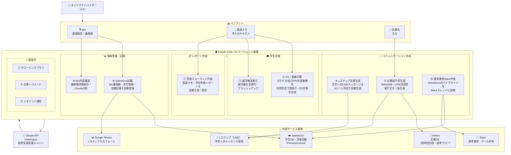

# HRサポート AI エージェントシステム 構成図

## システム全体図



---

## エージェント一覧（詳細）

| No. | エージェント名 | 入力 | 出力 | 連携先 |
|-----|-------------|------|------|--------|
| ① | ES・面接対策 | 面談メモ・対話 | ES文章 | - |
| ② | 就活軸深掘り | 面談メモ・対話 | 就活軸文章 | - |
| ⑥ | Lステップ文章生成 | 学生情報・シーン選択 | LINEメッセージ | Lステップ |
| ⑦ | 所感フォーマット作成 | 面談メモ | 所感レポート | - |
| ⑧ | Salesforce記載 | tldv議事録 | Account・Task登録 | Salesforce |
| ⑨ | tldv内容確認 | tldv URL/ファイル | 議事録分析 | tldv |
| ⑩ | 選考進捗Slack共有 | - | Slackスレッド投稿 | Salesforce・Slack |
| ⑪ | 企業紹介文生成 | 企業名 | LINE用紹介文 | Notion |

---

## データフロー（面談後の典型的な使い方）

```
面談（tldv録音）
    ↓
⑨ tldv内容確認 → 議事録を素早く確認・要約
    ↓
⑧ Salesforce記載 → 学生情報・活動記録を自動登録（手入力ゼロ）
    ↓
⑦ 所感フォーマット → 面談所感レポートを自動生成
    ↓
⑥ Lステップ文章生成 → フォローLINEメッセージを生成
    ↓
⑩ 選考進捗Slack共有 → チームへ進捗を自動通知
```
